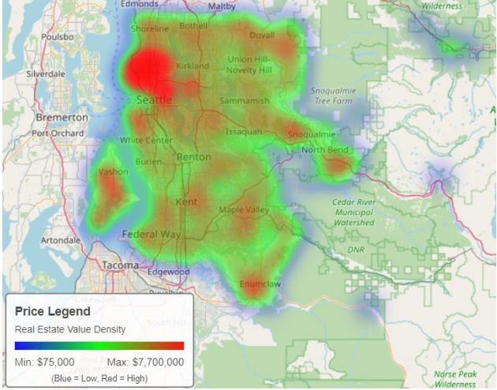
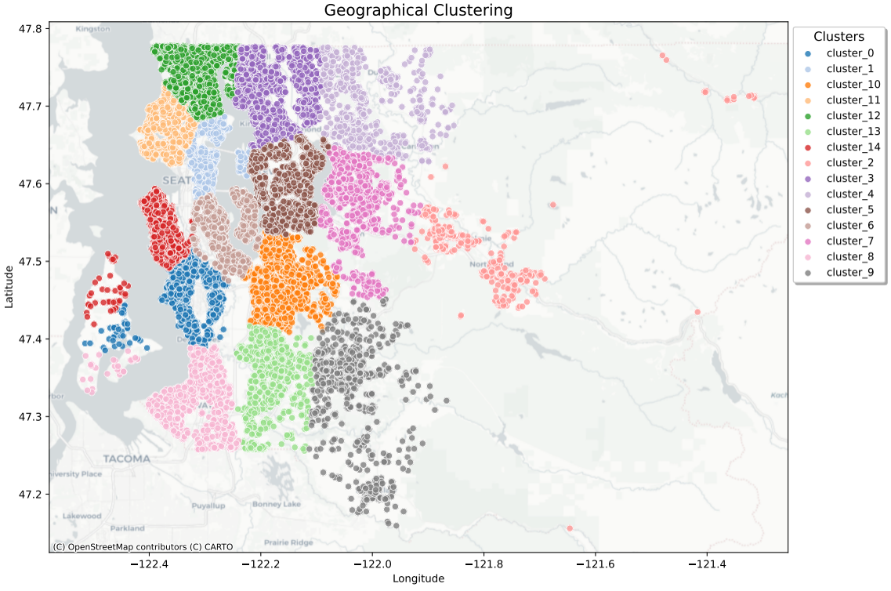
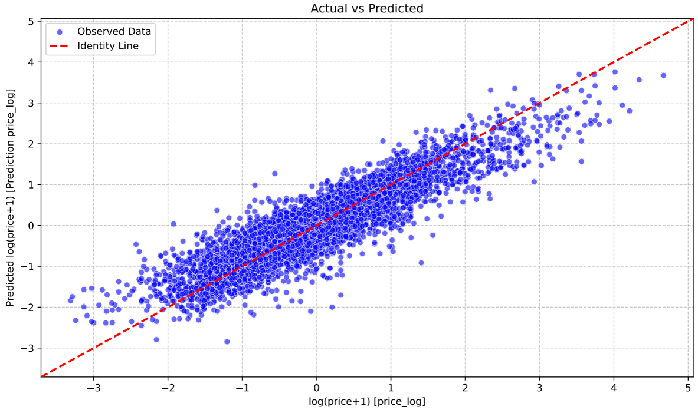
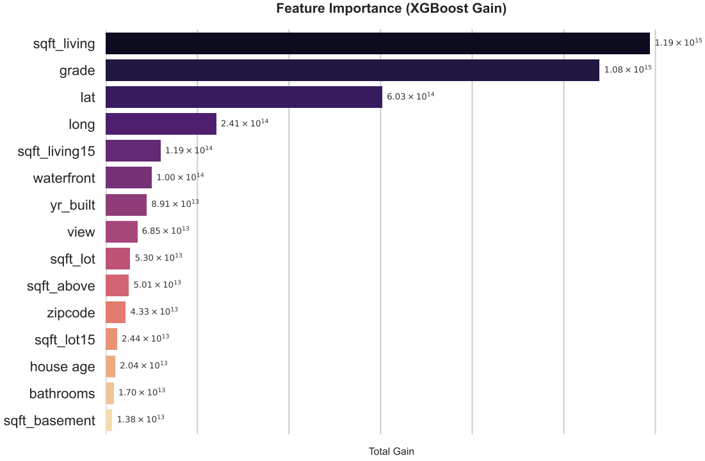

# House Price Prediction with regression models

### A Data-Driven Approach to Real Estate Valuation in King County


[](https://creativecommons.org/licenses/by/4.0/)

## 🌍 About the Project

Real estate valuation has traditionally relied heavily on subjective expertise, which often leads to pricing inconsistencies and high portfolio variance. 

This project details the development of a data-driven price estimation tool utilizing the [**King County House Sales (USA)** dataset from Kaggle](https://www.kaggle.com/harlfoxem/housesalesprediction)  (21,613 observations, 21 features). The study pursues a dual objective:
1. Constructing a highly accurate predictive machine learning model.
2. Interpreting the primary determinants of market value to support real estate decision-making.

> **TL;DR:** The analysis successfully transitioned from a parametric Linear Regression baseline to advanced non-parametric gradient boosting architectures. By combining spatial feature engineering (K-Means) with an XGBoost Tree Ensemble, the final model broke the 0.90 $R^2$ threshold. The study proves that structural magnitude, construction quality, and precise location are the foundational pillars of property value in King County.


## 📊 Key Findings & Visualizations

### 1. The Power of Spatial Feature Engineering
Standard spatial coordinates (latitude/longitude) hold no linear relationship with housing prices. We visualized the geographical distribution to assess the impact of location. The data confirms that high-value properties are spatially clustered, particularly in northern sectors and waterfront areas. 

<div align="center">
  
</div>

To provide the baseline linear model with a usable spatial structure, we engineered a K-Means clustering algorithm ($K=15$) to synthesize high-cardinality ZIP codes into homogeneous economic sub-markets. This custom geographic clustering proved to be an extremely significant predictor in the linear baseline.

<div align="center">
  
</div>

### 2. Model Performance: XGBoost Surpasses the 0.90 Barrier
A comparative analysis was conducted between a parametric Linear Regression baseline and non-parametric ensemble methods (Random Forest and XGBoost). 

The diagnostic evaluation of the linear baseline included an inspection of the Actual vs. Predicted scatter plot. The observed data points cluster tightly along the identity line, confirming the efficacy of the logarithmic transformation applied to the target variable.

<div align="center">
  
</div>

However, quantitative results designate the **XGBoost algorithm (Full Feature setup) as the superior architecture**. XGBoost demonstrated superior noise robustness, effectively leveraging secondary contextual variables (like neighborhood sizing `sqft_living15`) to capture complex market dynamics that simpler models discarded as noise.

**Final Model Comparison Summary**:

| Model Architecture | Configuration | Test $R^2$ | Test MAE |
| :--- | :--- | :--- | :--- |
| **Linear Regression** | Baseline (Log-Target) | 0.826 | 0.315* |
| **Random Forest** | Optimized (10 Features) | 0.884 | $69,869 |
| **XGBoost** | **Full (No Feature Selection)** | **0.901** | **$66,316** |

*\*Note: Linear Regression MAE is reported in log-scale units.*

### 3. The Three Pillars of Real Estate Value
XGBoost models were analyzed using the Total Gain metric that quantifies the average reduction in prediction error contributed by a feature. Feature importance analysis reveals that real estate prices in King County are a non-linear function defined by three fundamental pillars:
* **Physical Magnitude:** Total square footage of the living area (`sqft_living`).
* **Construction Quality:** Represented by the overall structural grade (`grade`).
* **Precise Location:** Captured via spatial clusters or raw latitude/longitude (`lat` or `lon`).

<div align="center">
  
</div>

## ⚙️ Methodology & Tech Stack

The analytical workflow was primarily implemented in **KNIME** to maintain a consistent low-code architecture. To bypass specific reporting limitations, **Python** scripting nodes were strategically integrated for advanced visualization and granular statistical diagnostics.

### Pipeline Highlights:
* **Data Preprocessing:** Logarithmic transformations of skewed variables (e.g., price, sqft_living) to satisfy the assumption of residual normality and homoscedasticity for the linear model.
* **Spatial Clustering:** Z-score normalization of coordinates followed by K-Means ($K=15$), validated via Silhouette analysis, Cohesion/Separation metrics, and the Dunn index.
* **Feature Selection:** Backward Feature Elimination strategy applied to optimize the balance between complexity and predictive accuracy.
* **Model Validation:** 10-Fold Cross-Validation confirmed the structural stability of the models.


## 🚀 Future Work

Despite the global model's robustness, the application of a uniform decision logic across a heterogeneous market remains a limitation. Future development should therefore focus on **Stratified Segmentation Modeling**, partitioning the dataset into distinct price tiers (e.g., Economy, Mid-Range, Luxury). Training specific sub-models for each tier allows for the capture of granular nuances, offering a pathway to further reduce residual variance in extreme market segments.

### 🔍 Dive Deeper
Want to explore the mathematical details of the K-Means validation (Silhouette, Cohesion/Separation), the full diagnostic plots, and a deeper dive into the algorithmic differences between the models?

**📄 [Read the full Data Analysis Report (PDF)](report/Report_Team_65.pdf)**

## 📂 Repository Structure

```text
House-Price-Prediction-KNIME/
├── data/               # Contains the King County House Sales dataset
├── workflow/           # The exported .knwf KNIME workflow file
├── report/             # Full academic report (Report_Team_65.pdf)
├── images/             # PNG exports of key project charts
├── environment.yml     # Conda environment file for easy project reproducibility
└── README.md
```
## ▶️ How to Reproduce the Analysis

The core of this project is built visually using KNIME Analytics Platform. To explore the data pipeline, train the models, and view the outputs, follow these steps:

1. **Clone the repository:**
   ```bash
   git clone [https://github.com/lolluz01/House-Price-Prediction-KNIME.git](https://github.com/lolluz01)
   ```
2. **Set up the Python Environment (Conda)**
To ensure all Python dependencies (like Pandas, Scikit-Learn, Contextily, etc.) work perfectly with the KNIME Python Integration, recreate the exact Conda environment using the provided YAML file:
   ```bash
   conda env create -f environment.yml
   ```
3. **Run the KNIME Workflow:**
* Open **KNIME Analytics Platform**.
* Go to `File` > `Import KNIME Workflow...`
* Choose `Select file:` and browse to the `workflow/` folder in this repository to select the `ML_project.knwf` file.
* Ensure KNIME is configured to use the newly created Conda environment for any Python Integration nodes.
* Execute all nodes.
> [!NOTE]
> **Note:** Since the workflow integrates custom Python scripts for advanced visualizations and diagnostics, ensure that the KNIME Python Integration extension is installed and configured with the libraries listed in the tech stack.

## 📄 License

This project is licensed under the  
**Creative Commons Attribution 4.0 International (CC BY 4.0)** license.

You are free to:
- **Share** — copy and redistribute the material in any medium or format  
- **Adapt** — remix, transform, and build upon the material  

Under the following terms:
- **Attribution** — You must give appropriate credit, provide a link to the license, and indicate if changes were made.

🔗 https://creativecommons.org/licenses/by/4.0/

## 👨‍💻 Authors

**Lorenzo Lecci** - *Data Science Student* @ University of Milan-Bicocca 

This project was developed in collaboration with my classmates Diana Carbone Radchenko and Martina Tropeano as part of the Machine Learning course.

[](https://www.linkedin.com/in/lorenzo-lecci-793789297/)
